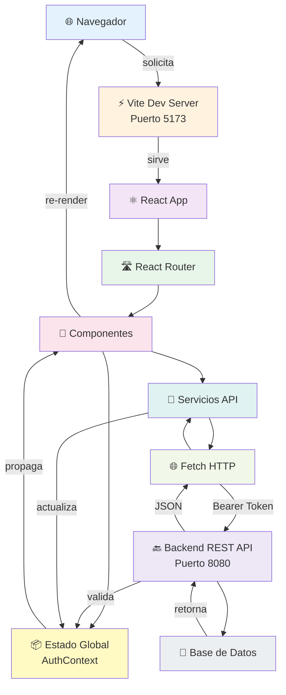
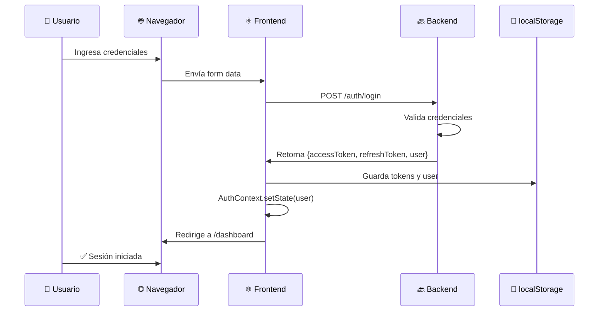
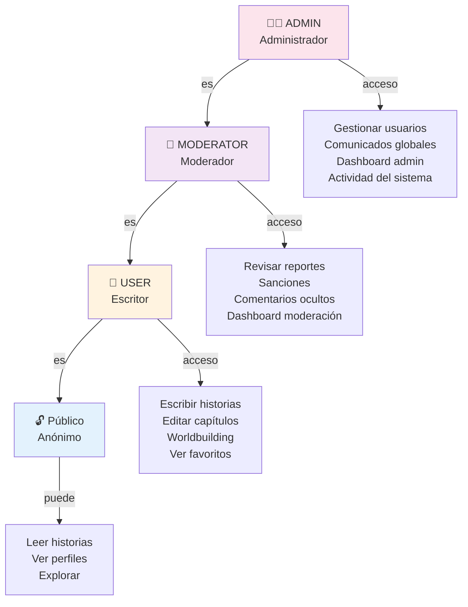

# Arquitectura del Frontend

## Flujo de Datos General



## Arquitectura en Capas

```
┌─────────────────────────────────────────────────────────────┐
│                    CAPA DE PRESENTACIÓN                     │
│  Páginas (19+) • Componentes (20+) • UI/UX                  │
├─────────────────────────────────────────────────────────────┤
│                    CAPA DE ENRUTAMIENTO                      │
│  React Router • Routes • ProtectedRoute • StaffOnly          │
├─────────────────────────────────────────────────────────────┤
│                    CAPA DE ESTADO GLOBAL                     │
│  AuthContext • useAuth Hook • User Data                      │
├─────────────────────────────────────────────────────────────┤
│                    CAPA DE NEGOCIO                           │
│  Servicios API • Lógica de aplicación • Utilidades           │
├─────────────────────────────────────────────────────────────┤
│                    CAPA DE INTEGRACIÓN HTTP                  │
│  Cliente Fetch • Headers • Interceptores • Tokens            │
├─────────────────────────────────────────────────────────────┤
│                    BACKEND REST API                          │
│  Endpoints (100+) • Controladores • Servicios                │
└─────────────────────────────────────────────────────────────┘
```

## Patrones Arquitectónicos

### 1. Patrón MVC Adaptado

```
Model (Estado)
  ↓
View (Componentes)
  ↓
Controller (Servicios API)
  ↓
Backend (Negocio)
```

### 2. Patrón Container/Presentational

- **Container Components** (Páginas): Manejan lógica y estado
- **Presentational Components**: Reciben props, renderizan UI

### 3. Patrón Context API para Estado Global

```jsx
AuthProvider (raíz)
  ↓
useAuth() hook
  ↓
Componentes consumidores
```

## Flujo de Autenticación Detallado



## Ciclo de Vida de una Solicitud API

```
1. Usuario interactúa (click, form submit)
    ↓
2. Componente llama a servicio (e.g., api.stories.list())
    ↓
3. Servicio valida y llama a fetch()
    ↓
4. Fetch agrega token Bearer en headers
    ↓
5. Backend recibe, valida, procesa
    ↓
6. Backend retorna JSON
    ↓
7. Componente recibe datos
    ↓
8. setState(data) → Re-render
    ↓
9. Usuario ve contenido actualizado
```

## Gestión de Errores

```
┌─────────────────────────────────────┐
│       Solicitud API falla           │
└────────────────┬────────────────────┘
                 │
         ┌───────┴────────┐
         │                │
         ▼                ▼
    HTTP Error        Network Error
         │                │
    ┌────┴────┐      ┌────┴────┐
    │          │      │         │
   401       404    Timeout  No conexión
    │          │      │         │
    ▼          ▼      ▼         ▼
 Refresh   Show      Retry   Show Error
 Token     Error             & Retry Btn
```

## Roles y Permisos



## Componentes Principales

### Envoltorio de Aplicación

```
Shell
├── Header (navegación)
├── Router
│   ├── Rutas públicas
│   │   └── Home, Explore, Authors, Community
│   ├── Rutas privadas (Protected)
│   │   └── Dashboard, WriterPanel, StoryEditor
│   └── Rutas de staff (StaffOnly)
│       └── Moderation, AdminPanel
└── Footer
```

### Estructura de Páginas Privadas

```
ProtectedRoute (verifica auth)
└── Página (e.g., WriterPanel)
    ├── Header/TopBar
    ├── Sidebar
    ├── Main Content
    └── Modals/Dialogs
```

## Flujo de Renderizado Condicional

```jsx
// Patrón usado en páginas
{loading && <LoadingState />}
{error && <ErrorState onRetry={retry} />}
{!data?.length && <EmptyState />}
{data?.length > 0 && <ContentView data={data} />}
```

## Almacenamiento de Datos

### localStorage

```
rdp_access_token   → JWT para autenticación
rdp_refresh_token  → JWT para renovar sesión
rdp_user          → Objeto usuario (JSON)
rdp_visitor_token → ID único de visitante
```

### Contexto (AuthContext)

```
user              → {id, email, username, role, accessLevel}
isAuthenticated   → boolean
loading           → boolean (mientras valida sesión)
login()           → async (credentials)
logout()          → async ()
register()        → async (data)
```

## Ciclo de Vida de Componente Típico

```
1. Component monta
   ↓
2. useEffect dispara (si tiene dependencias)
   ↓
3. Llama a API
   ↓
4. setState(loading: true)
   ↓
5. Datos llegan
   ↓
6. setState(data, loading: false)
   ↓
7. Componente re-renderiza con datos
   ↓
8. Usuario ve contenido
```

## Validación de Roles

```jsx
// En componentes
const { user } = useAuth();
const isAdmin = user?.role === 'admin';

// En rutas
<Route 
  path="/admin" 
  element={
    <AdminOnly>
      <AdminPanel />
    </AdminOnly>
  }
/>
```

## Patrón de Servicios API

```js
// Estructura general
export const api = {
  auth: {
    login: (credentials) => request('POST /auth/login', credentials),
    logout: (token) => request('POST /auth/logout', token),
    me: () => request('GET /auth/me')
  },
  stories: {
    list: (params) => request('GET /stories', params),
    create: (data) => request('POST /stories', data),
    update: (id, data) => request('PUT /stories/:id', data)
  }
}
```
