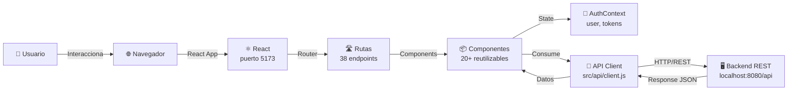

# Arquitectura del Frontend

## Flujo General de Datos



## Arquitectura en Capas

```
┌─────────────────────────────────────────────────┐
│          CAPA DE PRESENTACIÓN (UI)              │
│  ┌──────────────┐      ┌──────────────┐         │
│  │ Pages (18)   │      │ Components   │         │
│  │ - Home       │      │ (20+)        │         │
│  │ - Reader     │      │ - StoryCard  │         │
│  │ - Dashboard  │      │ - Header     │         │
│  │ - etc...     │      │ - Shell      │         │
│  └──────────────┘      └──────────────┘         │
└──────────────────────────────────────────────────┘
         ↓                     ↓
┌──────────────────────────────────────────────────┐
│    CAPA DE LÓGICA / ESTADO (Logic Layer)         │
│  ┌──────────────┐                                │
│  │ AuthContext  │ Gestiona usuario, tokens      │
│  │ + useAuth()  │                                │
│  └──────────────┘                                │
└──────────────────────────────────────────────────┘
         ↓
┌──────────────────────────────────────────────────┐
│      CAPA DE SERVICIOS (API Integration)         │
│  ┌──────────────────────────────────────────┐    │
│  │ src/api/client.js                        │    │
│  │ - Configuración de baseURL               │    │
│  │ - Interceptores de request/response      │    │
│  │ - Manejo de tokens                       │    │
│  │ - Gestión de errores                     │    │
│  │ - 100+ endpoints documentados            │    │
│  └──────────────────────────────────────────┘    │
└──────────────────────────────────────────────────┘
         ↓ HTTP/REST
┌──────────────────────────────────────────────────┐
│         BACKEND API REST (Spring/Node)           │
│  http://localhost:8080/api                       │
│  - JWT Authentication                            │
│  - Database (Users, Stories, Comments, etc)      │
└──────────────────────────────────────────────────┘
```

## Flujo de Autenticación

```mermaid
flowchart TD
    A["Usuario sin sesión"] -->|Navega a /acceso| B["AuthPage"]
    B -->|Ingresa credenciales| C["Login Form"]
    C -->|POST /auth/login| D["Backend"]
    D -->|Valida credenciales| E["JWT Response"]
    E -->|accessToken<br/>refreshToken<br/>user| F["storage.setAccessToken()"]
    F -->|Almacena en localStorage| G["Redirecciona a /dashboard"]
    G -->|useAuth() hook| H["AuthContext"]
    H -->|user = logueado| I["Acceso a rutas privadas"]
    
    J["Token expirado"] -->|401 Unauthorized| K["Interceptor"]
    K -->|POST /auth/refresh| L["Backend"]
    L -->|Nuevo accessToken| M["Reintenta solicitud original"]
    M -->|Éxito| N["Continúa operación"]
```

## Solicitud HTTP Típica

```
1. Component renderiza → useEffect
2. useEffect llama → api.stories.list()
3. api.client.js:
   - Prepara headers { Authorization: Bearer token }
   - Realiza fetch
4. Interceptor REQUEST:
   - Agrega token automáticamente
5. Backend procesa y responde
6. Interceptor RESPONSE:
   - Si 401 → POST /auth/refresh
   - Si 200 → Retorna datos
7. Componente actualiza state → Re-render
```

## Estados de Componentes

Cada página sigue este patrón de estados:

```javascript
const [loading, setLoading] = useState(true);
const [error, setError] = useState(null);
const [data, setData] = useState([]);

// Render condicional
{loading && <LoadingBlock />}
{error && <ErrorBlock error={error} />}
{data.length === 0 && <EmptyBlock />}
{data && <StoryCard story={data[0]} />}
```

## Componentes Principales

### Por Tipo

**Layout Base**
- `Shell` - Contenedor general con Header y Footer
- `Header` - Navegación y autenticación
- `WriterNav` / `WriterTabs` - Navegación específica de escritores

**Páginas Públicas**
- `Home` - Feed de historias con ranking
- `Explore` - Búsqueda y filtros
- `StoryCover` - Portada de historia
- `Reader` - Lector de capítulos
- `AuthorProfile` - Perfil público de autor

**Páginas Privadas**
- `Dashboard` / `WriterPanel` - Panel del escritor
- `WriterStudio` / `QuickWrite` - Editor rápido
- `StoryEditor` - Editor completo de historias
- `AccountSettings` / `ProfileSettings` - Configuración de cuenta

**Componentes Reutilizables**
- `StoryCard` - Card con portada, título, autor
- `RankingPanel` - Lista de historias top
- `CommentsThread` - Comentarios con respuestas
- `RatingBox` - Calificación de historia
- `FavoritesPanel` - Panel de favoritos
- `ApiState` - Estados de carga/error

## Protección de Rutas

```jsx
// Componentes que protegen acceso
<Protected>        // Solo usuarios autenticados
<StaffOnly>        // Admin o moderador
<AdminOnly>        // Solo admin
```

Ubicación: `src/App.jsx` lines 16-47

## Gestión de Tokens

**Almacenamiento**
```javascript
const ACCESS_TOKEN_KEY = 'rdp_access_token';
const REFRESH_TOKEN_KEY = 'rdp_refresh_token';
const USER_KEY = 'rdp_user';
const VISITOR_KEY = 'rdp_visitor_token';
```

**Ciclo de Vida**
1. Login → Backend retorna tokens
2. Se almacenan en localStorage
3. Se incluyen en headers `Authorization: Bearer {token}`
4. Si expira (401) → POST /auth/refresh
5. Logout → Se borran de localStorage

## Error Handling

```javascript
// Clase personalizada para errores de API
class ApiError extends Error {
  constructor(message, status, payload) {
    super(message);
    this.status = status;
    this.payload = payload;
  }
}

// Uso
try {
  const data = await api.stories.list();
} catch (error) {
  if (error.status === 401) {
    // Token inválido
  } else if (error.status === 403) {
    // Sin permisos
  } else {
    // Otro error
  }
}
```

## Roles y Permisos

```
┌────────────────────────────────────────┐
│ Anónimo                                │
│ - Acceso: Home, Explore, StoryCover    │
│ - Puede: Leer, Buscar, Ver perfiles    │
└────────────────────────────────────────┘
         ↓ (Login)
┌────────────────────────────────────────┐
│ User (Escritor)                        │
│ - Acceso: Dashboard, WriterStudio      │
│ - Puede: Crear historias, comentar     │
└────────────────────────────────────────┘
         ↓ (Rol upgrade)
┌────────────────────────────────────────┐
│ Moderator                              │
│ - Acceso: Moderation (además de User)  │
│ - Puede: Revisar reportes, ocultar    │
└────────────────────────────────────────┘
         ↓ (Rol upgrade)
┌────────────────────────────────────────┐
│ Administrator                          │
│ - Acceso: AdminPanel (además de Mod)   │
│ - Puede: Gestionar usuarios, sistema   │
└────────────────────────────────────────┘
```

## Ciclo de Vida de Componente

```jsx
// 1. Componentiza monta
// 2. useState inicializa
// 3. JSX renderiza (con loading state)
// 4. useEffect dispara
// 5. API request comienza
// 6. Spinner/LoadingBlock muestra
// 7. Respuesta llega
// 8. setState ejecuta
// 9. Re-render con datos
// 10. Componente montado completo

useEffect(() => {
  let mounted = true;
  
  api.stories.list()
    .then(data => {
      if (mounted) setStories(data);
    })
    .catch(err => {
      if (mounted) setError(err);
    })
    .finally(() => {
      if (mounted) setLoading(false);
    });
    
  return () => { mounted = false; }; // Cleanup
}, []);
```

---

**Nota**: Esta arquitectura sigue patrones React modernos con separación de concerns clara entre presentación, lógica y acceso a datos.
