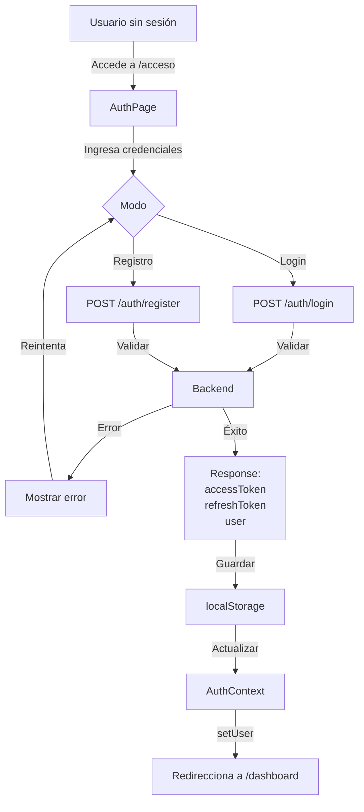

# Sistema de Autenticación

## Flujo de Autenticación Completo



---

## Almacenamiento de Tokens

### localStorage Keys

```javascript
// En src/api/client.js
const ACCESS_TOKEN_KEY = 'rdp_access_token';
const REFRESH_TOKEN_KEY = 'rdp_refresh_token';
const USER_KEY = 'rdp_user';
const VISITOR_KEY = 'rdp_visitor_token';
```

### Estructura Guardada

```javascript
// accessToken - JWT de acceso (corta duración, típicamente 15-30 min)
"eyJhbGciOiJIUzI1NiIsInR5cCI6IkpXVCJ9..."

// refreshToken - JWT de refresco (larga duración, típicamente 7 días)
"eyJhbGciOiJIUzI1NiIsInR5cCI6IkpXVCJ9..."

// user - JSON del usuario
{
  "id": 1,
  "email": "user@example.com",
  "displayName": "Juan Pérez",
  "role": "user",
  "avatar": "https://...",
  "createdAt": "2024-01-15T10:30:00Z"
}

// visitorToken - UUID anónimo para rastrear
"550e8400-e29b-41d4-a716-446655440000"
```

---

## Login

### Flujo

```
1. Usuario completa formulario
   ├─ Email
   └─ Contraseña

2. Click "Iniciar Sesión"
   ├─ Valida campos localmente
   └─ POST /auth/login

3. Backend procesa
   ├─ Busca usuario por email
   ├─ Verifica contraseña (bcrypt)
   ├─ Si válido: genera tokens
   └─ Si inválido: retorna 401

4. Respuesta exitosa
   ├─ storage.setAccessToken(token)
   ├─ storage.setRefreshToken(token)
   ├─ storage.setUser(user)
   ├─ AuthContext.setUser(user)
   └─ Redirecciona a /dashboard

5. Respuesta con error
   ├─ Muestra mensaje de error
   └─ Usuario permanece en /acceso
```

### Código de Ejemplo

```jsx
import { useState } from 'react';
import { useNavigate } from 'react-router-dom';
import { useAuth } from '../context/AuthContext';

export default function LoginForm() {
  const [email, setEmail] = useState('');
  const [password, setPassword] = useState('');
  const [loading, setLoading] = useState(false);
  const [error, setError] = useState(null);
  const navigate = useNavigate();
  const { login } = useAuth();

  const handleSubmit = async (e) => {
    e.preventDefault();
    setLoading(true);
    setError(null);

    try {
      await login({ email, password });
      navigate('/dashboard');
    } catch (err) {
      setError(err.message || 'Error al iniciar sesión');
    } finally {
      setLoading(false);
    }
  };

  return (
    <form onSubmit={handleSubmit}>
      <input
        type="email"
        value={email}
        onChange={(e) => setEmail(e.target.value)}
        placeholder="Email"
        required
      />
      <input
        type="password"
        value={password}
        onChange={(e) => setPassword(e.target.value)}
        placeholder="Contraseña"
        required
      />
      {error && <div className="error">{error}</div>}
      <button type="submit" disabled={loading}>
        {loading ? 'Iniciando sesión...' : 'Iniciar Sesión'}
      </button>
    </form>
  );
}
```

---

## Registro

### Flujo

```
1. Usuario en /acceso?modo=registro

2. Completa formulario
   ├─ Nombre
   ├─ Email
   ├─ Contraseña
   ├─ Confirmar contraseña
   └─ Aceptar términos

3. Click "Registrarse"
   ├─ Valida campos localmente
   ├─ Verifica contraseña válida (8+ chars, etc)
   └─ POST /auth/register

4. Backend procesa
   ├─ Verifica email no existe
   ├─ Hash contraseña (bcrypt)
   ├─ Crea usuario en DB
   ├─ Genera tokens
   └─ Envía email de verificación

5. Respuesta exitosa
   ├─ Guarda tokens (igual que login)
   ├─ AuthContext.setUser(user)
   └─ Redirecciona a /dashboard

6. Email de verificación (background)
   └─ Usuario debe hacer click en link
      └─ POST /auth/verify-email
```

---

## Refresh de Token

### Problema

El `accessToken` expira (típicamente en 15-30 minutos).

### Solución: Refresh Token

```javascript
// En src/api/client.js

async function request(path, options = {}) {
  // ... código anterior ...
  
  const response = await fetch(url, {
    method,
    headers: finalHeaders,
    body: requestBody
  });

  // Si 401 (token expirado)
  if (response.status === 401) {
    const refreshToken = storage.getRefreshToken();
    
    if (refreshToken) {
      try {
        // Pedir nuevo accessToken
        const refreshed = await request('/auth/refresh', {
          method: 'POST',
          body: { refreshToken },
          auth: false
        });

        // Guardar nuevo token
        storage.setAccessToken(refreshed.accessToken);

        // Reintentar request original
        finalHeaders.Authorization = `Bearer ${refreshed.accessToken}`;
        return fetch(url, { method, headers: finalHeaders, body: requestBody });
      } catch (err) {
        // Si refresh falla, usuario debe loguearse de nuevo
        storage.clear();
        window.location.href = '/acceso';
      }
    }
  }

  return response;
}
```

**Flujo:**
```
1. API request
   └─ GET /stories (con accessToken)

2. Backend rechaza (401 Token expirado)

3. Cliente automáticamente:
   ├─ Detecta 401
   ├─ POST /auth/refresh
   ├─ Obtiene nuevo accessToken
   └─ Reintenta GET /stories

4. Éxito: request original se completa
```

---

## Logout

### Flujo

```
1. Usuario hace click "Cerrar Sesión"
   └─ onClick={() => logout()}

2. AuthContext.logout()
   ├─ POST /auth/logout (con refreshToken)
   ├─ storage.clear()
   ├─ setUser(null)
   ├─ AuthContext actualiza
   └─ Redirecciona a /

3. Componentes se re-renderizan
   └─ Links privados desaparecen
   └─ Header muestra "Iniciar Sesión"
```

### Código

```jsx
import { useAuth } from '../context/AuthContext';
import { useNavigate } from 'react-router-dom';

export default function UserMenu() {
  const { logout } = useAuth();
  const navigate = useNavigate();

  const handleLogout = async () => {
    await logout();
    navigate('/');
  };

  return <button onClick={handleLogout}>Cerrar Sesión</button>;
}
```

---

## Validación de Sesión

### Al Montar la App

```jsx
// En AuthContext.jsx

useEffect(() => {
  let mounted = true;

  // Si no hay token guardado, no hacer nada
  if (!storage.getAccessToken()) {
    setLoading(false);
    return undefined;
  }

  // Si hay token, validar que sea válido
  api.auth.me()
    .then((me) => {
      if (mounted) {
        setUser(me);
        storage.setUser(me);
      }
    })
    .catch(() => {
      // Token inválido/expirado
      storage.clear();
      if (mounted) setUser(null);
    })
    .finally(() => {
      if (mounted) setLoading(false);
    });

  return () => { mounted = false; };
}, []);
```

**Garantiza:**
- Si usuario actualiza página: sesión se mantiene
- Si token expiró: se limpia storage
- Si backend está offline: se retiene sesión local (puede fallar requests)

---

## Roles y Permisos

### Tipos de Roles

```javascript
// En backend
enum Role {
  USER = 'user',                  // Usuario normal/escritor
  MODERATOR = 'moderator',       // Moderador
  ADMIN = 'administrator'        // Administrador
}
```

### Guardado en User

```javascript
{
  id: 1,
  email: "user@example.com",
  role: "user"  // o "moderator" o "administrator"
}
```

### Protección de Rutas

```jsx
// En App.jsx

function StaffOnly({ children }) {
  const { user, isAuthenticated, loading } = useAuth();
  const level = String(user?.role || '').toLowerCase();
  const staff = ['admin', 'moderator'].includes(level);

  if (loading) return <LoadingScreen />;
  if (!isAuthenticated) return <Navigate to="/acceso" />;
  if (!staff) return <Navigate to="/dashboard" />;

  return children;
}

function AdminOnly({ children }) {
  const { user, isAuthenticated, loading } = useAuth();
  const level = String(user?.role || '').toLowerCase();
  const admin = ['admin', 'administrator'].includes(level);

  if (loading) return <LoadingScreen />;
  if (!isAuthenticated) return <Navigate to="/acceso" />;
  if (!admin) return <Navigate to="/moderacion" />;

  return children;
}
```

### Rutas Protegidas

```jsx
<Route path="/moderacion" element={<StaffOnly><Moderation /></StaffOnly>} />
<Route path="/admin" element={<AdminOnly><AdminPanel /></AdminOnly>} />
```

---

## Seguridad

### Best Practices Implementadas

✅ **Tokens JWT**
- No se guardan en cookies (vulnerable a CSRF)
- Se envían en header `Authorization: Bearer {token}`
- Validados en backend

✅ **Contraseñas**
- Hash bcrypt en backend
- Validación de fuerza en frontend
- Mínimo 8 caracteres (recomendado)

✅ **Refresh Tokens**
- Mayor duración (típicamente 7 días)
- Se rotean automáticamente
- Expiración controlada en backend

✅ **HTTPS en Producción**
- Usar siempre HTTPS en producción
- Cookies con flag Secure si se usan

✅ **CORS**
- Validar origen en backend
- Solo permitir dominios conocidos

### Headers de Seguridad Recomendados

```javascript
// En backend, agregar headers
response.setHeader('X-Content-Type-Options', 'nosniff');
response.setHeader('X-Frame-Options', 'SAMEORIGIN');
response.setHeader('X-XSS-Protection', '1; mode=block');
response.setHeader('Strict-Transport-Security', 'max-age=31536000; includeSubDomains');
response.setHeader('Content-Security-Policy', "default-src 'self'");
```

---

## OAuth y Autenticación Social

> **Pendiente de completar según configuración real del proyecto.**

Posibles integraciones:
- Google OAuth
- GitHub OAuth
- Microsoft OAuth

---

## Recuperación de Contraseña

### Flujo

```
1. Usuario en /acceso hace click "¿Olvidó contraseña?"
   └─ Va a /recuperar-contrasena (si existe)

2. Ingresa email y hace submit
   ├─ POST /auth/forgot-password
   ├─ Backend genera token seguro
   └─ Envía email con link

3. Usuario hace click en link del email
   ├─ Redirecciona a /restablecer?token=...
   ├─ Usuario ingresa nueva contraseña
   └─ POST /auth/reset-password

4. Éxito
   ├─ Contraseña se actualiza
   └─ Redirecciona a /acceso

5. Usuario puede loguearse con nueva contraseña
```

---

## Debugging de Autenticación

### Ver Tokens en localStorage

```javascript
// En console del navegador
localStorage.getItem('rdp_access_token')
localStorage.getItem('rdp_refresh_token')
JSON.parse(localStorage.getItem('rdp_user'))
```

### Decodificar JWT

```javascript
// Para inspeccionar payload del token
function parseJwt(token) {
  const base64Url = token.split('.')[1];
  const base64 = base64Url.replace(/-/g, '+').replace(/_/g, '/');
  const jsonPayload = decodeURIComponent(
    atob(base64)
      .split('')
      .map((c) => '%' + ('00' + c.charCodeAt(0).toString(16)).slice(-2))
      .join('')
  );
  return JSON.parse(jsonPayload);
}

// Uso
const token = localStorage.getItem('rdp_access_token');
console.log(parseJwt(token));
// { iat: ..., exp: ..., sub: ..., ... }
```

### Verificar Headers en Requests

1. Abre DevTools (F12)
2. Pestaña "Network"
3. Realiza una acción (buscar, guardar)
4. Click en request
5. Tab "Headers"
6. Busca `Authorization: Bearer ...`

---

**Última actualización**: Enero 2024
