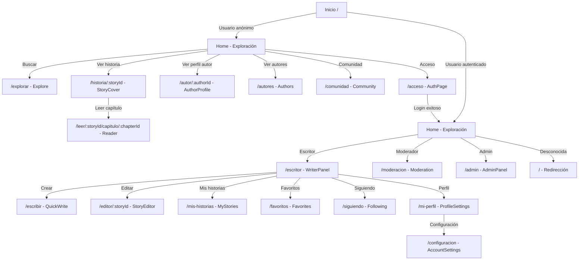

# Rutas del Sistema

## Mapa de Navegación



---

## Rutas Públicas (Sin Autenticación)

### Descubrimiento y Lectura

| Ruta | Componente | Descripción | Acceso |
|---|---|---|---|
| `/` | `Home` | Feed principal con ranking y búsqueda | Público |
| `/explorar` | `Explore` | Búsqueda avanzada y filtros | Público |
| `/autores` | `Authors` | Listado de autores | Público |
| `/comunidad` | `Community` | Área de comunidad | Público |
| `/historia/:storyId` | `StoryCover` | Portada de historia con capítulos | Público |
| `/leer/:storyId/capitulo/:chapterId` | `Reader` | Lector inmersivo de capítulos | Público |
| `/autor/:authorId` | `AuthorProfile` | Perfil público de autor | Público |

### Autenticación

| Ruta | Componente | Descripción | Acceso |
|---|---|---|---|
| `/acceso` | `AuthPage` | Login y Registro | Público |
| `/acceso?modo=registro` | `AuthPage` | Modo registro | Público |

---

## Rutas Privadas (Autenticación Requerida)

### Panel del Escritor

| Ruta | Componente | Descripción | Acceso |
|---|---|---|---|
| `/escritor` | `WriterPanel` | Panel principal de escritor | Usuario |
| `/dashboard` | `WriterPanel` | Alias de /escritor | Usuario |
| `/escribir` | `QuickWrite` | Editor rápido de capítulos | Usuario |
| `/editor/:storyId` | `StoryEditor` | Editor completo de historias | Usuario |
| `/mis-historias` | `WriterPanel` | Gestor de historias personales | Usuario |

### Perfil y Configuración

| Ruta | Componente | Descripción | Acceso |
|---|---|---|---|
| `/mi-perfil` | `ProfileSettings` | Configuración de perfil | Usuario |
| `/configuracion` | `AccountSettings` | Configuración de cuenta | Usuario |

### Social

| Ruta | Componente | Descripción | Acceso |
|---|---|---|---|
| `/favoritos` | `Favorites` | Mis historias favoritas | Usuario |
| `/siguiendo` | `Following` | Usuarios que sigo | Usuario |

---

## Rutas de Moderación (Staff)

| Ruta | Componente | Descripción | Acceso |
|---|---|---|---|
| `/moderacion` | `Moderation` | Panel de moderación | Moderador+ |

**Requiere rol:** `moderator` o `admin`

---

## Rutas de Administración (Admin)

| Ruta | Componente | Descripción | Acceso |
|---|---|---|---|
| `/admin` | `AdminPanel` | Panel de administrador | Admin |

**Requiere rol:** `administrator` o `admin`

---

## Parámetros de Ruta

### Rutas Dinámicas

```javascript
// Parámetro: storyId
/historia/123                    // ID de historia
/editor/45                       // ID de historia a editar
/leer/10/capitulo/205            // ID de historia y capítulo

// Parámetro: authorId
/autor/8                         // ID de autor

// Parámetro: chapterId
/leer/10/capitulo/205            // ID de capítulo
```

### Query Parameters

```javascript
// Búsqueda
/explorar?q=aventura             // Búsqueda por texto
/explorar?sort=views             // Ordenar por vistas

// Paginación
/?page=2                         // Página (en Home)
/?sort=createdAt,desc            // Ordenamiento

// Autenticación
/acceso?modo=registro            // Modo registro
/acceso?modo=login               // Modo login (default)
```

---

## Flujo de Navegación Completo

### Usuario Anónimo

```
1. Accede a /
   ├─ Ve feed público
   ├─ Puede buscar en /explorar
   ├─ Puede leer historias
   └─ No accede a rutas privadas

2. Intenta acceder a /escritor
   └─ Protected redirige a /acceso

3. Click en "Registrarse"
   ├─ Va a /acceso?modo=registro
   ├─ Completa formulario
   ├─ POST /auth/register
   └─ Redirecciona a /dashboard (autenticado)
```

### Usuario Autenticado

```
1. Accede a /
   ├─ Ve feed público (igual que antes)
   ├─ Botón "Escribir" visible en header
   └─ Avatar en navbar

2. Click en "Escribir"
   ├─ Va a /escritor
   ├─ Ve sus historias
   ├─ Click en crear
   └─ Va a /escribir

3. Click en "Mi perfil"
   ├─ Va a /mi-perfil
   ├─ Edita información
   └─ Guarda cambios

4. Logout
   ├─ POST /auth/logout
   ├─ Limpia tokens
   └─ Redirecciona a /
```

### Usuario Moderador

```
1. Autenticado como moderador
   ├─ Acceso a todas las rutas de usuario
   ├─ Navbar muestra link "/moderacion"
   └─ Click accede a /moderacion

2. En /moderacion
   ├─ Ve reportes pendientes
   ├─ Puede revisar y resolver
   └─ Acceso a dashboard de moderación
```

### Administrador

```
1. Autenticado como admin
   ├─ Acceso a todas las rutas previas
   ├─ Navbar muestra link "/admin"
   └─ Click accede a /admin

2. En /admin
   ├─ Gestión de usuarios
   ├─ Ver actividad del sistema
   ├─ Crear comunicados globales
   └─ Acceso completo del sistema
```

---

## Protección de Rutas

### Componentes de Protección

```jsx
// En App.jsx
<Protected>              // Solo usuarios autenticados
<StaffOnly>             // Admin o moderador
<AdminOnly>             // Solo admin
```

### Lógica de Validación

```javascript
function Protected({ children }) {
  const { isAuthenticated, loading } = useAuth();
  
  if (loading) return <LoadingScreen />;
  if (!isAuthenticated) return <Navigate to="/acceso" />;
  
  return children;
}

function StaffOnly({ children }) {
  const { user, loading } = useAuth();
  const level = String(user?.role || '').toLowerCase();
  const staff = ['admin', 'moderator'].includes(level);
  
  if (loading) return <LoadingScreen />;
  if (!staff) return <Navigate to="/dashboard" />;
  
  return children;
}
```

---

## Rutas Especiales

### Redirecciones

```javascript
// Ruta no encontrada
/xyz                    → Redirecciona a /

// Acceso a ruta privada sin auth
/escritor (sin token)   → Redirecciona a /acceso

// Acceso a admin sin rol
/admin (no-admin)       → Redirecciona a /dashboard

// Login cuando ya autenticado
/acceso (autenticado)   → Podría redirigir a /dashboard
```

### Rutas Alias

```javascript
/escritor    = /dashboard   // Mismo componente WriterPanel
```

---

## Estado de Rutas

### Active Route Indicators

```jsx
// En Header.jsx
const isActive = location.pathname === '/mi-perfil';

<Link to="/mi-perfil" className={isActive ? 'active' : ''}>
  Mi Perfil
</Link>
```

---

## Estructura en Código

### App.jsx

```jsx
import { Routes, Route, Navigate } from 'react-router-dom';

export default function App() {
  return (
    <Shell>
      <Routes>
        {/* Rutas públicas */}
        <Route path="/" element={<Home />} />
        <Route path="/explorar" element={<Explore />} />
        <Route path="/historia/:storyId" element={<StoryCover />} />
        
        {/* Rutas privadas */}
        <Route path="/escritor" 
          element={<Protected><WriterPanel /></Protected>} />
        
        {/* Rutas de staff */}
        <Route path="/moderacion" 
          element={<StaffOnly><Moderation /></StaffOnly>} />
        
        {/* Rutas de admin */}
        <Route path="/admin" 
          element={<AdminOnly><AdminPanel /></AdminOnly>} />
        
        {/* Catch-all */}
        <Route path="*" element={<Navigate to="/" replace />} />
      </Routes>
    </Shell>
  );
}
```

---

## Navegación Programática

### Usando useNavigate

```jsx
import { useNavigate } from 'react-router-dom';

function MyComponent() {
  const navigate = useNavigate();
  
  const goToDashboard = () => {
    navigate('/dashboard');
  };
  
  const goBack = () => {
    navigate(-1);
  };
  
  return <button onClick={goToDashboard}>Ir a Dashboard</button>;
}
```

### Usando Link

```jsx
import { Link } from 'react-router-dom';

<Link to="/historia/123">Ver Historia</Link>
```

---

## URL Canónica

La aplicación usa URLs limpias sin # (hash routing):

```
✅ http://localhost:5173/historia/123
❌ http://localhost:5173/#/historia/123
```

---

**Última actualización**: Enero 2024
