# Rutas y Navegación

## Mapa de Rutas Completo

```mermaid
graph TD
    Root["/"] -->|público| Home["🏠 Home"]
    Root -->|público| Explore["🔍 Explorar"]
    Root -->|público| Authors["👥 Autores"]
    Root -->|público| Community["💬 Comunidad"]
    Root -->|público| StoryCover["📖 Portada Historia"]
    Root -->|público| Reader["📕 Lector"]
    Root -->|público| AuthProfile["👤 Perfil Autor"]
    Root -->|público| AuthPage["🔐 Acceso"]
    
    Root -->|privado| WriterPanel["✍️ Panel Escritor"]
    Root -->|privado| QuickWrite["✏️ Escritura Rápida"]
    Root -->|privado| StoryEditor["📝 Editor Historia"]
    Root -->|privado| Dashboard["📊 Dashboard"]
    Root -->|privado| Favorites["⭐ Favoritos"]
    Root -->|privado| Following["👀 Siguiendo"]
    Root -->|privado| ProfileSettings["⚙️ Perfil"]
    Root -->|privado| AccountSettings["🔧 Cuenta"]
    
    Root -->|staff| Moderation["🛡️ Moderación"]
    
    Root -->|admin| AdminPanel["👨‍💼 Admin"]
    
    style Home fill:#e3f2fd
    style Explore fill:#e3f2fd
    style Authors fill:#e3f2fd
    style Community fill:#e3f2fd
    style StoryCover fill:#e3f2fd
    style Reader fill:#e3f2fd
    style AuthProfile fill:#e3f2fd
    style AuthPage fill:#fff3e0
    style WriterPanel fill:#f3e5f5
    style QuickWrite fill:#f3e5f5
    style StoryEditor fill:#f3e5f5
    style Dashboard fill:#f3e5f5
    style Favorites fill:#f3e5f5
    style Following fill:#f3e5f5
    style ProfileSettings fill:#f3e5f5
    style AccountSettings fill:#f3e5f5
    style Moderation fill:#fce4ec
    style AdminPanel fill:#fce4ec
```



## Tabla de Rutas

| Ruta | Componente | Descripción | Tipo de Acceso | Parámetros |
|------|-----------|-------------|-----------------|------------|
| `/` | Home | Página de inicio pública | Público | - |
| `/explorar` | Explore | Exploración de historias con filtros | Público | `?q=`, `?genre=`, `?status=` |
| `/autores` | Authors | Listado de autores | Público | - |
| `/comunidad` | Community | Página de comunidad | Público | - |
| `/acceso` | AuthPage | Login / Registro | Público | - |
| `/historia/:storyId` | StoryCover | Detalles y portada de historia | Público | `storyId` (number) |
| `/leer/:storyId/capitulo/:chapterId` | Reader | Lector de capítulo | Público | `storyId`, `chapterId` (numbers) |
| `/autor/:authorId` | AuthorProfile | Perfil público del autor | Público | `authorId` (number) |
| `/escribir` | QuickWrite | Escritura rápida/temporal | Privado | - |
| `/editor/:storyId` | StoryEditor | Editor de historia | Privado | `storyId` (number) |
| `/mis-historias` | WriterPanel | Panel del escritor - Mis historias | Privado | - |
| `/escritor` | WriterPanel | Panel del escritor (alias) | Privado | - |
| `/dashboard` | WriterPanel | Dashboard - alias a panel escritor | Privado | - |
| `/mi-perfil` | ProfileSettings | Configuración de perfil | Privado | - |
| `/favoritos` | Favorites | Historias marcadas como favoritas | Privado | - |
| `/siguiendo` | Following | Autores que sigue el usuario | Privado | - |
| `/configuracion` | AccountSettings | Configuración de cuenta | Privado | - |
| `/moderacion` | Moderation | Panel de moderación | Staff only | - |
| `/admin` | AdminPanel | Panel administrativo | Admin only | - |
| `*` | - | Ruta no encontrada | - | Redirige a `/` |

## Componentes de Protección de Rutas

### Protected (Rutas Privadas)

```jsx
<Protected>
  <WriterPanel />
</Protected>
```

**Comportamiento:**
- Verifica si el usuario está autenticado
- Si no → Redirige a `/acceso`
- Si sí → Renderiza componente
- Mientras valida → Muestra spinner

### StaffOnly (Rutas de Moderadores+)

```jsx
<StaffOnly>
  <Moderation />
</StaffOnly>
```

**Comportamiento:**
- Verifica autenticación
- Verifica que `user.role` sea `'moderator'` o `'admin'`
- Si no cumple → Redirige a `/dashboard`

### AdminOnly (Rutas de Administradores)

```jsx
<AdminOnly>
  <AdminPanel />
</AdminOnly>
```

**Comportamiento:**
- Verifica autenticación
- Verifica que `user.role` sea `'admin'`
- Si no cumple → Redirige a `/moderacion`

## Flujo de Navegación Típico

### Nuevo Usuario (No Autenticado)

```
1. Llega a http://localhost:5173/
   ↓
2. Ve Home pública
   ↓
3. Intenta acceder a /mi-perfil
   ↓
4. Protected verifica auth → FALLA
   ↓
5. Redirige a /acceso
   ↓
6. Ve Login/Registro
```

### Usuario Autenticado

```
1. Llega a /acceso
   ↓
2. Hace login
   ↓
3. AuthContext actualiza (user, isAuthenticated)
   ↓
4. App redirige a /dashboard
   ↓
5. Ve WriterPanel con contenido personalizado
```

### Moderador

```
1. User con role = 'moderator'
   ↓
2. Accede a /moderacion
   ↓
3. StaffOnly valida role ✓
   ↓
4. Ve Moderation panel
   ↓
5. No puede acceder a /admin
   ↓
6. AdminOnly redirige a /moderacion
```

## Parámetros de Ruta

### Dynamic Route Params

```jsx
// En URL
/historia/42              // storyId = 42
/leer/42/capitulo/3       // storyId = 42, chapterId = 3
/autor/123                // authorId = 123
/editor/99                // storyId = 99

// En componente
const { storyId, chapterId, authorId } = useParams();
```

### Query Params

```jsx
// En URL
/explorar?q=magia&genre=fantasy&status=published

// En componente
const searchParams = new URLSearchParams(location.search);
const query = searchParams.get('q');
const genre = searchParams.get('genre');
```

## Redirecciones Automáticas

| De | A | Razón |
|----|---|-------|
| `*` (cualquier ruta no definida) | `/` | Fallback 404 |
| Ruta privada (no autenticado) | `/acceso` | Requiere login |
| Ruta staff (user normal) | `/dashboard` | Permisos insuficientes |
| Ruta admin (moderator) | `/moderacion` | Requiere admin |

## Estados de Carga en Rutas

Mientras se valida la autenticación, se muestra:

```jsx
{loading ? (
  <section className="page">
    <div className="state-block">
      <span className="spinner" /> Validando sesión...
    </div>
  </section>
) : (
  // Contenido
)}
```

## Estructura de Navegación

### Header (Público)

```
┌─────────────────────────────────────────┐
│  Logo   │ Inicio | Explorar | Autores   │ Acceso
└─────────────────────────────────────────┘
```

### Sidebar (Privado)

```
Dashboard
├─ Mis Historias
├─ Escribir
├─ Favoritos
├─ Siguiendo
├─ Mi Perfil
├─ Configuración
└─ [Moderación] (si es moderador)
└─ [Admin] (si es admin)
```

## Cambios de Ruta Comunes

### Usuario escribe una historia

```
/escribir
   ↓ (crear historia)
/editor/:storyId
   ↓ (guardar/publicar)
/mis-historias
   ↓ (ver historia publicada)
/historia/:storyId
```

### Usuario lee historia

```
/ o /explorar
   ↓ (click en card)
/historia/:storyId
   ↓ (click en capítulo)
/leer/:storyId/capitulo/:chapterId
   ↓ (click siguiente capítulo)
/leer/:storyId/capitulo/:nextChapterId
```

### Moderador revisa reportes

```
/dashboard
   ↓ (click en Moderación)
/moderacion
   ↓ (selecciona reporte)
   ↓ (revisa contenido reportado)
   ↓ (toma acción: sancionar/rechazar)
/moderacion
```
